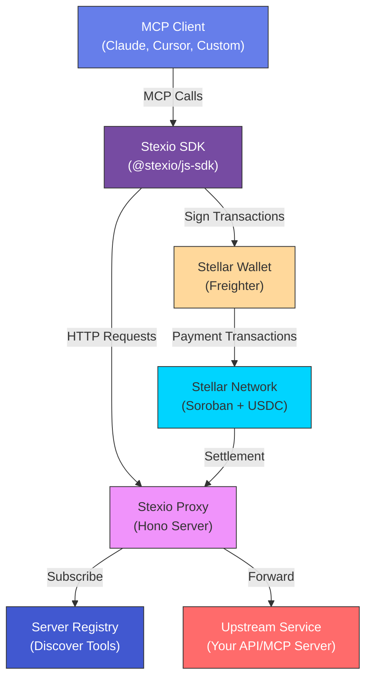
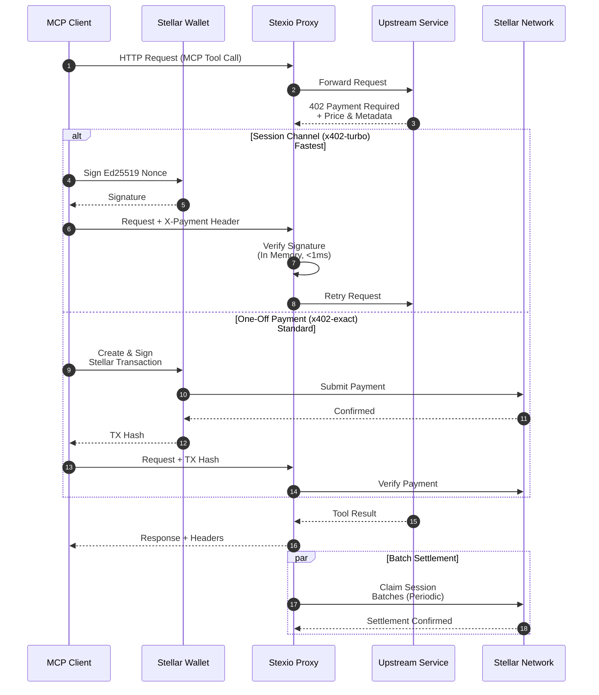
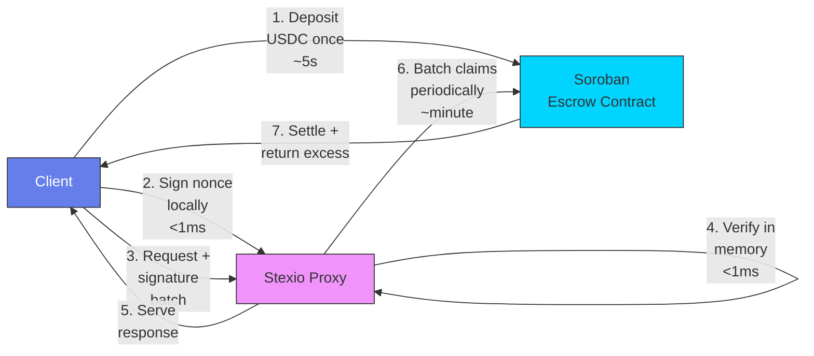
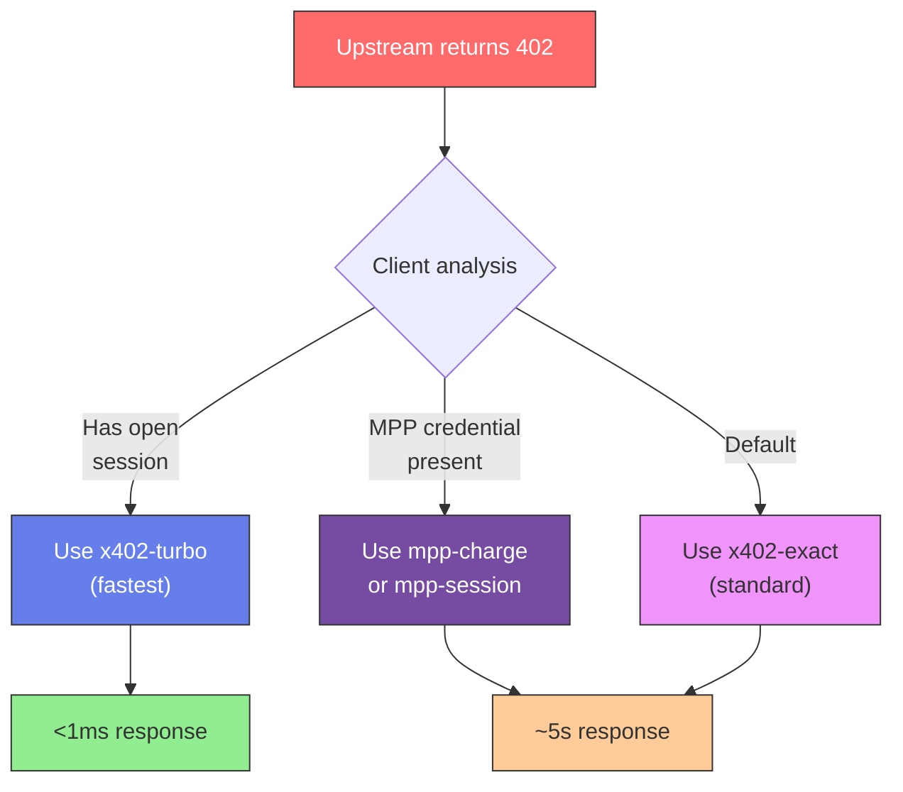
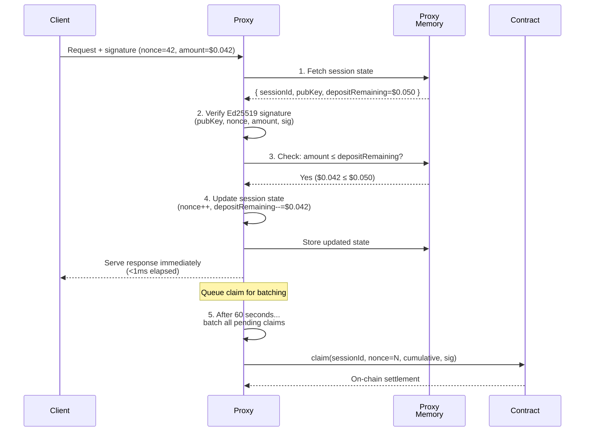
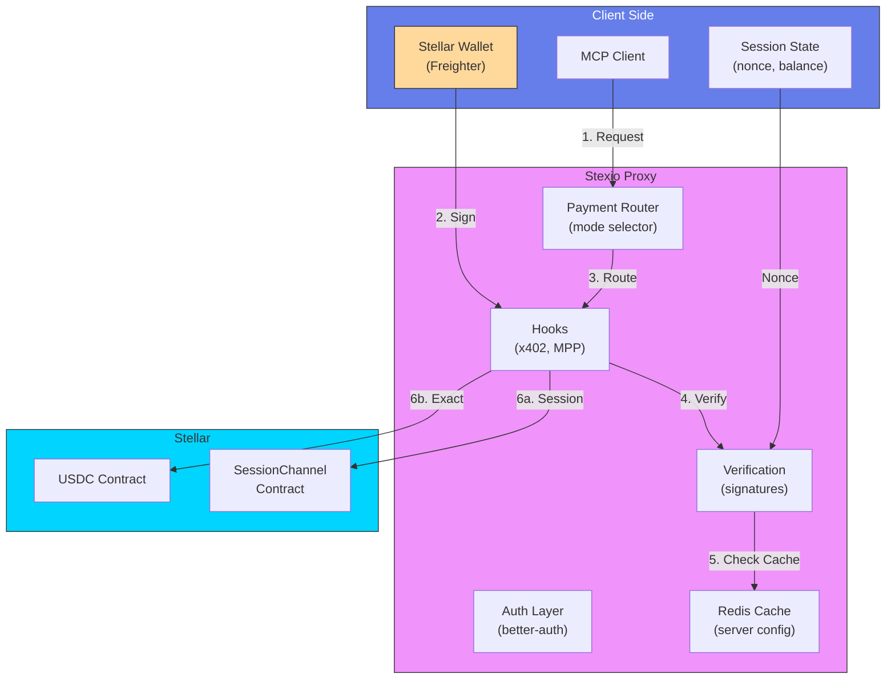
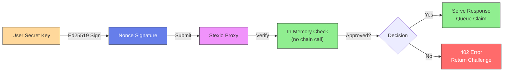

<div align="center">

 

**[Website](https://stexio.vercel.app)** • **[Browse Registry](https://stexio.vercel.app/servers)** • **[Register / Monetize](https://stexio.vercel.app/register)** • **[Documentation](https://stexio.vercel.app/docs)**

</div>

---

## What is Stexio?

**Stexio** is an open-source **marketplace, proxy, and SDK** for paid [Model Context Protocol (MCP)](https://modelcontextprotocol.io) servers — built entirely on the **Stellar blockchain**.

It enables **on-chain micropayments** for MCP tools using the [x402 "Payment Required" protocol](https://x402.org), allowing AI agents and applications to **pay-per-call** instead of relying on subscriptions or API keys. All payments are settled instantly on Stellar: fast, cheap, and programmable.

**For end users (AI agents, apps):** Call expensive APIs, data services, or proprietary tools without pre-paying or managing API keys. Pay _exactly_ for what you use—per invocation—with no middleman.

**For API/service providers:** Monetize your HTTP service, SaaS API, or data product instantly through the Stexio marketplace. Reach millions of AI agents and applications, receive payments directly to your Stellar wallet, and focus on building—not payment processing.

---

## Table of Contents

- [Why Stexio? (Two-Sided Marketplace)](#why-stexio-two-sided-marketplace)
- [Architecture Overview](#architecture-overview)
  - [System Components](#system-components)
  - [Request Flow Diagram](#request-flow-diagram)
- [Payment Modes](#payment-modes)
  - [Session Channels Deep Dive](#session-channels-deep-dive)
- [How to Use Stexio](#how-to-use-stexio)
  - [Payment Mode Selection Logic](#payment-mode-selection-logic)
- [The Stexio Marketplace](#the-stexio-marketplace)
- [x402-turbo: High-Speed Micropayments (Core Feature)](#x402-turbo-high-speed-micropayments-core-feature)
  - [Why x402-turbo?](#why-x402-turbo)
  - [How x402-turbo Works](#how-x402-turbo-works)
  - [The Math: Speed Comparison](#the-math-speed-comparison)
  - [Use Cases](#use-cases)
  - [Session Lifecycle](#session-lifecycle)
  - [Security & Idempotency](#security--idempotency)
- [Ecosystem Components](#ecosystem-components)
  - [Global Server Registry](#1-global-server-registry)
  - [Stexio Proxy](#2-stexio-proxy)
  - [Stexio SDK](#3-stexio-sdk)
- [Quickstart](#quickstart)
  - [Option A — CLI (Connect to a Paid Tool)](#option-a--cli-connect-to-a-paid-tool)
  - [Option B — Programmatic Client (SDK)](#option-b--programmatic-client-sdk)
  - [USDC Decimals on Stellar](#important-usdc-decimals-on-stellar)
- [For API Providers: Start Earning Now](#for-api-providers-start-earning-now)
  - [Three Paths to Monetization](#three-paths-to-monetization)
  - [Web Dashboard (Easiest)](#-monetize-via-web-dashboard-easiest)
  - [SDK Wrapper (Full Control)](#-monetize-via-sdk-full-control)
  - [Multi-Service Platform (Advanced)](#-multi-service-platform-advanced)
- [Installation](#installation)
- [Architecture & Technical Details](#architecture--technical-details)
  - [Data Flow](#data-flow)
  - [Technical Stack](#technical-stack)
  - [Configuration & Constants](#configuration--constants)
  - [Security Model](#security-model)
- [Performance Characteristics](#performance-characteristics)
- [License](#license)
- [Resources](#resources)

---

## Why Stexio? (Two-Sided Marketplace)

| **For End Users**                                                                                                                     | **For API/Service Providers**                                                                                                                                            | **For Autonomous Agents**                                                                                                                           |
| ------------------------------------------------------------------------------------------------------------------------------------- | ------------------------------------------------------------------------------------------------------------------------------------------------------------------------ | --------------------------------------------------------------------------------------------------------------------------------------------------- |
| **Pay only for what you use** — No subscriptions, no commitments, no unused monthly credits. Just fair, transparent per-call pricing. | **Monetize instantly via the Stexio marketplace** — Convert your API, SaaS, dataset, or inference service into a revenue stream without building payment infrastructure. | **Make real autonomous purchases** — Agents can call paid tools without human approval, unlocking true autonomous workflows at scale.               |
| **Works everywhere** — Stexio's payment headers plug into any MCP-compatible client (Claude, Cursor, etc.)                            | **Get discovered globally** — List your service in the public registry where millions of AI agents and applications browse tools. Instant reach, zero marketing.         | **Session channels for speed** — Batch thousands of payments per minute using x402-turbo session channels—not even a blockchain wait for each call. |
| **Stay in control** — Set max spending limits, see real-time usage, cancel anytime                                                    | **Receive payments directly** — USDC settles instantly to your Stellar wallet. No payment processor fees, no 30-day settlements. No KYC.                                 | **Programmable payments** — MCP clients are now composable financial entities. Build workflows that were impossible before.                         |
|                                                                                                                                       | **Zero integration cost** — Use the SDK or web dashboard to wrap existing APIs with x402 support in minutes. No database migrations, no rewrites needed.                 |                                                                                                                                                     |

---

## Architecture Overview

### System Components



### Request Flow Diagram



---

## Payment Modes

Stexio supports **three parallel payment protocols**, each optimized for different use cases. The client (or agent wallet) automatically selects the best mode:

| Mode             | Latency    | Settlement                      | Best for                                       |
| ---------------- | ---------- | ------------------------------- | ---------------------------------------------- |
| **`x402-turbo`** | **< 1 ms** | Batched on-chain<br/>(periodic) | **High-frequency agents**<br/>500+ calls/min   |
| **`x402-exact`** | ~5 seconds | Per-call<br/>on-chain           | **One-off requests**<br/>Verification required |
| **`mpp-charge`** | ~5 seconds | Per-action<br/>on-chain         | **Complex billing**<br/>Multi-party workflows  |

### Session Channels Deep Dive

The latency bottleneck of standard x402 is the **~5 second blockchain confirmation** per call. For an autonomous agent making 500 calls per minute (like a multi-tool reasoning loop), this is a dealbreaker.

**x402-turbo Session Channels** fix this:



**How it works:**

1. **One opening transaction** (~5s) — Client deposits USDC into a Soroban escrow contract
2. **Signature-based verification** (<1ms) — Each API call includes an Ed25519 signature of the cumulative amount owed
3. **In-memory proof** — Proxy verifies the signature locally without touching blockchain
4. **Batched settlement** — Server collects signatures and submits periodic claims (e.g., every 60 seconds)
5. **Idempotent claims** — Each claim covers the full cumulative amount, not just the delta (replay-proof)
6. **Instant refund** — When session closes, unspent USDC is returned to client

**Example:** An agent calls a $0.001 USDC API tool 500 times in 60 seconds.

- Traditional x402: `500 × 5s = 2500s = ~42 minutes` of blocking waiting
- x402-turbo: `5s (open) + 500ms (500 signatures) + 5s (claim) = ~10.5s total`

---

## How to Use Stexio

### Payment Mode Selection Logic

When the Stexio proxy intercepts a `402 Payment Required` response, it returns all supported modes in an `accepts[]` array. The client intelligently picks the best one:



---

## The Stexio Marketplace

Stexio is fundamentally a **two-sided marketplace** connecting:

- **Supply:** API providers, SaaS platforms, data vendors, ML inference services
- **Demand:** AI agents, applications, developers, autonomous workflows

**How it works:**

1. **Provider registers API** — Wrap existing service with x402 pricing (minutes to set up)
2. **Marketplace discovers it** — Indexed in global registry, visible to millions of agents
3. **Agents call & pay** — Per-request micropayments, no keys or subscriptions
4. **Provider gets paid** — USDC sett off your Stellar wallet instantly, every second of every day
5. **No intermediary fees** — Direct blockchain settlement

Think of it like **AppStore for AI agents**, but with instant payments and no platform tax.

---

## x402-turbo: High-Speed Micropayments (Core Feature)

**x402-turbo** is the innovation that makes Stexio revolutionary. It solves the fundamental latency problem of blockchain-based payments, enabling autonomous agents to make **thousands of paid API calls per minute** without waiting for blockchain confirmations.

### Why x402-turbo?

The standard x402 "Payment Required" protocol requires a new blockchain transaction for every single API call. On Stellar, each transaction takes ~5 seconds to confirm. For an AI agent making 500 calls per minute (typical for multi-tool reasoning):

| Payment Method            | Total Time                                                      | Usability              |
| ------------------------- | --------------------------------------------------------------- | ---------------------- |
| **x402-turbo (session)**  | 5s (setup) + 500 calls (instant) + 5s (close) = **~10 seconds** | Practical           |
| **x402-exact (per-call)** | 500 calls × 5s each = **2,500 seconds (~42 minutes)**           | Unusable for agents |
| **Traditional API keys**  | Instant but no micropayments, requires account setup            | No per-call pricing |

**x402-turbo fixes this** by separating payment _verification_ from payment _settlement_:

- Verification happens **in-memory** (<1ms per call)
- Settlement happens **periodically** on-chain (batched, once per minute)

### How x402-turbo Works

#### 1. Session Channel Lifecycle

```mermaid
graph LR
    User["User<br/>Agent"]
    Wallet["Stellar Wallet"]
    Proxy["Stexio Proxy"]
    Contract["Soroban<br/>Contract"]
    API["API Service"]

    User -->|1. Fund<br/>100 USDC<br/>~5s| Contract
    Contract -->|Channel<br/>Opened| Proxy

    User -->|2. Sign Local<br/>(Ed25519)| Wallet
    Wallet -->|Nonce<br/>Signature| User
    User -->|3. Request +<br/>Signature| Proxy
    Proxy -->|<1ms<br/>Verify| Proxy
    Proxy -->|4. Forward| API
    API -->|Response| Proxy
    Proxy -->|5. Result| User

    Proxy -->|6. Batch Claims<br/>Every 60s| Contract
    Contract -->|Settlement| User

    style User fill:#667eea,stroke:#333,color:#fff
    style Wallet fill:#ffd89b,stroke:#333,color:#333
    style Proxy fill:#f093fb,stroke:#333,color:#333
    style Contract fill:#00d4ff,stroke:#333,color:#333
    style API fill:#ff6b6b,stroke:#333,color:#fff
```

#### 2. Signature Scheme

Each call includes a **cumulative Ed25519 signature** covering the total amount owed:

```
Call 1: User owes $0.001  → Sign(nonce=1, cumulative=$0.001)
Call 2: User owes $0.002  → Sign(nonce=2, cumulative=$0.002)
Call 3: User owes $0.003  → Sign(nonce=3, cumulative=$0.003)
...
Call 500: User owes $0.50 → Sign(nonce=500, cumulative=$0.50)

// After 60 seconds, proxy claims:
Contract.claim(nonce=500, cumulative=$0.50, signature)
// One on-chain tx settles all 500 calls, no replay possible
```

This makes claims **idempotent** — the contract only needs the latest signature to verify everything.

#### 3. Verification Process



### The Math: Speed Comparison

#### Scenario: Weather Agent Calling a Paid API

```
Service: Get weather for 10 cities
Price: $0.001 USDC per call
Total cost: $0.01
Agent makes 10 calls in a loop
```

**Using x402-turbo (Session):**

```
1. Open session:        5 seconds (1 on-chain tx)
2. Call 1-10:          ~10ms each (signatures only, in-memory)
3. Total for 10 calls: ~100ms
4. Claim & settle:      5 seconds (1 on-chain tx, batched)
─────────────────────────────────
Total: ~10.1 seconds + result processing
```

**Using x402-exact (Per-call):**

```
1. Call 1:  5 seconds (on-chain tx)
2. Call 2:  5 seconds (on-chain tx)
3. Call 3:  5 seconds (on-chain tx)
...
10. Call 10: 5 seconds (on-chain tx)
─────────────────────────────────
Total: 50 seconds (NO parallelization possible)
```

**Performance gain: 5x faster, and scales linearly with more calls**

### Use Cases

#### 1. Multi-Tool Reasoning Agents (Primary Use Case)

AI agents orchestrating multiple paid tools in a reasoning loop:

```
Agent decision loop:
  → Call search_api (cost $0.001)
  → Call analysis_api (cost $0.005)
  → Call forecast_api (cost $0.002)
  → Call notification_api (cost $0.001)
  → Repeat 100 times per task

Total: 400 API calls, $1.80 cost
With x402-turbo: ~5s to complete
Without it: Would take 33+ minutes (unusable)
```

#### 2. Data Processing Pipelines

ETL jobs fetching data from multiple sources:

```
Pipeline: Download weather for 1,000 cities
Price: $0.0001 per call
Total cost: $0.10

With x402-turbo: ~5 seconds
Without: Would take 1+ hours
```

#### 3. Real-Time Decision Systems

Autonomous systems making instant queries:

```
Example: Trading bot checking 50 price feeds every second
50 feeds × 1 call/sec × $0.001 = $50/sec revenue
Requires <1ms latency per call (impossible with per-call settlement)
x402-turbo enables this
```

#### 4. Batch Processing with Mixed Pricing

Different APIs with different prices in one session:

```
Session: $10 budget
  → Premium API (expensive): $0.10/call
  → Standard API (cheap): $0.001/call
  → Mix and match freely in one session

All verified in-memory, settled once at the end
```

### Session Lifecycle

#### Opening a Session

```typescript
const session = new SessionChannelClient({
  proxyUrl: "https://stexio.xyz/v1/mcp/api",
  signer: stellarSigner,
  depositAmount: BigInt(100 * 10 ** 7), // 100 USDC
  network: "testnet",
});

// On-chain: Open escrow contract
// Off-chain: Receive sessionId + contractAddress
await session.open();
// Takes ~5 seconds, locked into contract
```

#### Making Calls

```typescript
// Each call: local signature + proxy verification
const result1 = await session.call("get_data", { query: "Q1" });
// <1ms response, signature verified in-memory
// Debit: $0.001 from session balance

const result2 = await session.call("get_data", { query: "Q2" });
// <1ms response
// Debit: $0.001 from session balance

// After 100 calls...
// Used: $0.10 from $100 deposit
// Still locked in contract
```

#### Claiming (Server-side, Periodic)

```
[Internal to Stexio Proxy] Every 60 seconds:
├─ Collect all pending signatures for this session
├─ Calculate cumulative amount owed
├─ Submit one on-chain claim tx
└─ Record settlement in ledger
```

#### Closing a Session

```typescript
// User initiates close
await session.close();
// On-chain: Return unspent USDC ($99.90) to user
// Off-chain: Mark session as closed
// Takes ~5 seconds
```

### Security & Idempotency

#### Why Cumulative Signatures?

Traditional approach (fragile):

```
Call 1: Sign(amount=$0.001)  [separate signature]
Call 2: Sign(amount=$0.001)  [separate signature]
→ Vulnerable to replay: Submit same $0.001 signature twice
```

x402-turbo approach (idempotent):

```
Call 1: Sign(nonce=1, cumulative=$0.001)
Call 2: Sign(nonce=2, cumulative=$0.002)
Call 3: Sign(nonce=3, cumulative=$0.003)
→ Cannot replay Call 1's signature—it would only prove $0.001 owed
  when the proxy has now verified nonces up to 3
→ Replay-proof by design
```

#### Monotonic Nonce

```
Nonce must always increase: 1 → 2 → 3 → 4 → ... → N
├─ Prevents reordering attacks
├─ Enables the proxy to detect stale signatures
└─ Makes claim settlement deterministic
```

#### Contract-Enforced Limits

```solidity
// Soroban contract validates claims:
claim(sessionId, nonce, cumulativeAmount, signature) {
  session = contracts[sessionId]

  // Verify signature
  assert(verify(session.pubKey, nonce, cumulativeAmount, sig))

  // Check monotonicity
  assert(nonce > session.lastNonce)

  // Enforce budget
  charged = cumulativeAmount - session.lastCumulative
  assert(charged <= session.depositRemaining)

  // Update state (idempotent)
  session.lastNonce = nonce
  session.lastCumulative = cumulativeAmount
  session.depositRemaining -= charged
}
```

#### Why It's Safe

**Nonce ensures ordering** — Can't reorder calls

**Cumulative signature prevents replay** — Each signature covers all prior calls

**On-chain claim is idempotent** — Resubmitting the same claim does nothing (nonce already seen)

**Contract enforces budget** — Can't spend more than deposited

**Escrow is atomic** — Funds either in contract or returned to user, never in limbo

---

### 1) Global Server Registry

A searchable, machine-readable directory of all registered MCP tools at **[stexio.xyz/servers](https://stexio.xyz/servers)**. Discover and compare tools from thousands of API providers worldwide.

**Registry features:**

- **Provider listing** — Get discovered by AI agents without marketing spend
- Searchable by tool name, description, category, and price
- Real-time pricing display (in USDC)
- Payment modes supported (x402-turbo, x402-exact, mpp)
- Usage statistics and ratings (coming soon)
- Machine-readable API for agents to auto-discover and integrate
- Revenue analytics for providers (coming soon)

### 2) Stexio Proxy

A reverse proxy gateway that sits in front of any HTTP or MCP service and automatically enforces x402 payments. **Zero code changes** to your upstream service.

**Key features:**

- Transparent HTTP/MCP proxying
- Automatic 402 detection and interception
- Support for all three payment modes simultaneously
- Per-tool pricing configuration
- Redis-backed server registry and rate limiting
- Built-in analytics and revenue tracking

### 3) Stexio SDK (`@stexio/js-sdk`)

The programmatic layer. Wrap any MCP client or server with payment support in minimal code. Includes:

- Full x402-turbo session channel client
- Session lifecycle management (open, claim, close)
- Automatic payment mode selection
- Stellar wallet integration (Freighter signing)
- CLI tool for connecting to paid MCP servers
- Server-side handlers for creating monetized tools

---

## Quickstart

### Option A — CLI (Connect to a Paid Tool)

The fastest way to try Stexio—connect to any registered MCP server from your terminal:

<details open>
<summary><strong>CLI: Connect with Secret Key</strong></summary>

```bash
npx stexio connect \
    --urls https://stexio.xyz/v1/mcp/weather-mcp \
    --stellar SA_YOUR_STELLAR_SECRET_KEY \
    --stellar-network testnet
```

**Flags:**

- `--urls` — Comma-separated list of Stexio proxy URLs
- `--stellar` — Your Stellar secret key (for signing payments)
- `--stellar-network` — `testnet` or `pubnet`
- `--max-payment` — Maximum USDC per call (default: 1 USDC, 7 decimals)

**Output:** A stdio MCP server you can pipe into Claude, Cursor, or any MCP client.

</details>

<details>
<summary><strong>MCP Client Config (Claude/Cursor)</strong></summary>

Add this to your Claude settings (`~/.config/Claude/claude.json`):

```json
{
  "mcpServers": {
    "Weather MCP (Paid)": {
      "command": "npx",
      "args": [
        "stexio",
        "connect",
        "--urls",
        "https://stexio.xyz/v1/mcp/weather-mcp",
        "--stellar",
        "SA_YOUR_STELLAR_SECRET_KEY",
        "--stellar-network",
        "testnet"
      ]
    }
  }
}
```

Restart Claude and the paid tool will appear in your tool list.

</details>

### Option B — Programmatic Client (SDK)

Build an agent with full control over payment logic, spending limits, and session management:

<details>
<summary><strong>Wrap MCP Client with Payments</strong></summary>

```typescript
import { Client } from "@modelcontextprotocol/sdk/client/index.js";
import { StreamableHTTPClientTransport } from "@modelcontextprotocol/sdk/client/streamableHttp.js";
import { withStellarClient } from "@stexio/js-sdk/client";
import { createStellarSigner } from "@stexio/js-sdk";

// 1. Create Stellar signer (handles Ed25519 signing)
const signer = createStellarSigner("testnet", process.env.STELLAR_SECRET_KEY!);

// 2. Create MCP transport to Stexio proxy
const url = new URL("https://stexio.xyz/v1/mcp/weather-mcp");
const transport = new StreamableHTTPClientTransport(url);

// 3. Initialize base MCP client
const base = new Client(
  { name: "my-weather-agent", version: "1.0.0" },
  { capabilities: {} },
);
await base.connect(transport);

// 4. Wrap with payment support — auto-handles 402s
const client = withStellarClient(base, {
  wallet: { stellar: signer },
  maxPaymentValue: BigInt(5 * 10 ** 7), // 5 USDC max per call
});

// 5. Use naturally—payments are transparent
const tools = await client.listTools();
const result = await client.callTool("get_weather", { city: "San Francisco" });
console.log(result);
```

**Key points:**

- `withStellarClient()` wraps the base client with payment handlers
- 402 responses trigger automatic payment (session or exact, depending on context)
- `maxPaymentValue` is a guard rail—calls exceeding this are rejected
- Session channels open automatically on first 402

</details>

<details>
<summary><strong>Custom Session Management</strong></summary>

For advanced workflows (multi-service agents, custom spending policies):

```typescript
import { SessionChannelClient } from "@stexio/js-sdk/session";
import { createStellarSigner } from "@stexio/js-sdk";

const signer = createStellarSigner("testnet", process.env.STELLAR_SECRET_KEY!);

const session = new SessionChannelClient({
  proxyUrl: "https://stexio.xyz/v1/mcp/weather-mcp",
  signer,
  depositAmount: BigInt(100 * 10 ** 7), // 100 USDC into session
  network: "testnet",
});

// Open a session (one on-chain transaction)
await session.open();

// Make multiple calls—signatures only, no blockchain waits
const result1 = await session.call("get_weather", { city: "NYC" });
const result2 = await session.call("get_weather", { city: "LA" });
const result3 = await session.call("get_weather", { city: "Chicago" });

// Claim batched signatures (one on-chain, settles all three calls)
await session.claim();

// Close session (returns unused USDC)
await session.close();
```

**Useful for:** High-frequency agents, multi-tool orchestration, custom spend controls.

</details>

### Important: USDC Decimals on Stellar

Stellar USDC uses **7 decimal places**, not 6 like EVM chains.

| Amount     | Raw Value               | Example         |
| ---------- | ----------------------- | --------------- |
| 0.001 USDC | `1_000` stroops         | Micro-payment   |
| 0.01 USDC  | `10_000` stroops        | Small API call  |
| 1 USDC     | `10_000_000` stroops    | Standard call   |
| 100 USDC   | `1_000_000_000` stroops | Batch operation |

Always use `BigInt()` to avoid floating-point precision errors.

---

## For API Providers: Start Earning Now

Don't have an MCP server yet? No worries. You can monetize **any** HTTP API—SaaS platform, data service, inference endpoint, or legacy API—in minutes.

### Three Paths to Monetization

| Path              | Time to Revenue | Best For                           |
| ----------------- | --------------- | ---------------------------------- |
| **Web Dashboard** | **5 minutes**   | Existing HTTP APIs, quick testing  |
| **SDK Wrapper**   | **15 minutes**  | New or heavily customized services |
| **Proxy Deploy**  | **30 minutes**  | Multi-service platform operators   |

<details>
<summary><strong>Monetize via Web Dashboard (Easiest)</strong></summary>

1. Go to **[stexio.xyz/register](https://stexio.xyz/register)**
2. Enter your service URL (any HTTP endpoint)
3. Configure pricing per route (e.g., `/api/weather` = $0.001)
4. Set payment modes
5. Hit "Deploy" — Stexio manages the proxy

**That's it.** Your service is now:

- In the global registry
- Accepting payments immediately
- Receiving USDC to your wallet daily
- Zero code changes to your backend

Your existing API requests just start requiring x402 payment headers. All payment verification, signature validation, and settlement is handled by Stexio.

</details>

<details>
<summary><strong>Monetize via SDK (Full Control)</strong></summary>

For more control, wrap your API with the SDK:

```typescript
import { Hono } from "hono";
import { withX402 } from "@stexio/js-sdk/server";
import { z } from "zod";

const app = new Hono();

const handler = withX402(
  (server) => {
    server.paidTool(
      "get_data",
      "Premium data API",
      "$0.05", // $0.05 per call
      { query: z.string() },
      {},
      async ({ query }) => {
        const result = await myDataService.fetch(query);
        return { content: [{ type: "text", text: JSON.stringify(result) }] };
      },
    );
  },
  {
    recipient: {
      stellar: {
        address: "GB...YOUR_ADDRESS",
        isTestnet: true, // Set to false for mainnet
      },
    },
    paymentModes: ["x402-turbo", "x402-exact"],
  },
  {
    serverInfo: { name: "my-data-api", version: "1.0.0" },
  },
);

app.use("*", (c) => handler(c.req.raw));
export default app;
```

Deploy to Vercel, Cloudflare, or any Node.js host. Register in the Stexio marketplace.

</details>

<details>
<summary><strong>Multi-Service Platform (Advanced)</strong></summary>

Running a data marketplace or SaaS platform with multiple APIs? Use the proxy to monetize all services at once:

```bash
# Deploy Stexio proxy in front of your API cluster
npx stexio-proxy \
  --upstream https://api.myplatform.com \
  --recipient GB...YOUR_ADDRESS \
  --redis-url $UPSTASH_REDIS_REST_URL
```

Configure pricing per service/endpoint in the dashboard. All revenue flows to your Stellar wallet.

</details>

**Revenue Sharing & Support:**

- **Stexio takes 0%** — You keep 100% of payments (minus $0.001 settlement cost per claim)
- **No upfront fees** — Free to register and monetize
- **Community support** — Docs, examples and discord (coming soon)
- **SLA coming soon** — Uptime guarantees for production providers

---

---

## Installation

```bash
npm install @stexio/js-sdk
# or
pnpm add @stexio/js-sdk
```

**Requirements:** Node.js ≥ 20

---

## Architecture & Technical Details

### Data Flow



### Technical Stack

#### Frontend/Client (`@stexio/js-sdk`)

- **Stellar SDK** — Keypair generation, transaction signing
- **Stellar Wallets Kit** — Browser wallet integration (Freighter)
- **x402-turbo-stellar** — Session channel logic (imported, not reimplemented)
- **TypeScript strict mode** — Full type safety

#### Backend/Proxy (`apps/proxy`)

- **Hono** — Lightweight HTTP framework
- **Drizzle ORM** — Type-safe database access
- **Neon PostgreSQL** — Server registry and user data
- **Upstash Redis** — Distributed server config cache
- **better-auth** — Multi-method auth (GitHub OAuth, email, Stellar wallet)
- **Soroban SDK** — Contract interaction for x402-turbo and exact verification

#### Payment Infrastructure

| Layer          | Technology                | Purpose                        |
| -------------- | ------------------------- | ------------------------------ |
| **Protocol**   | x402 + x402-turbo + MPP   | Payment negotiation            |
| **Execution**  | Stellar Soroban Contracts | Escrow, settlement, claims     |
| **Token**      | USDC (7 decimals)         | Transaction currency           |
| **Settlement** | Stellar Network           | Finality & atomic confirmation |

### Configuration & Constants

<details>
<summary><strong>Environment Variables</strong></summary>

```bash
# Stellar Network
STELLAR_NETWORK=testnet
STELLAR_RPC_URL=https://soroban-testnet.stellar.org
STELLAR_NETWORK_PASSPHRASE="Test SDF Network ; September 2015"
STELLAR_SERVER_SECRET_KEY=S...  # Proxy's signing key

# USDC Contract
USDC_CONTRACT_ID=CBIELTK6YBZJU5UP2WWQEUCYKLPU6AUNZ2BQ4WWFEIE3USCIHMXQDAMA
USDC_DECIMALS=7  # NOT 6 like EVM

# x402-turbo (Session Channels)
SESSION_CONTRACT_ID=C...        # Deployed SessionChannel
FACILITATOR_URL=https://www.x402.org/facilitator

# Database (Neon PostgreSQL)
DATABASE_URL=postgresql://...neon.tech/stexio

# Auth (better-auth)
BETTER_AUTH_SECRET=...
BETTER_AUTH_URL=http://localhost:3000
GITHUB_CLIENT_ID=...
GITHUB_CLIENT_SECRET=...

# Cache (Upstash Redis)
UPSTASH_REDIS_REST_URL=https://...upstash.io
UPSTASH_REDIS_REST_TOKEN=...

# Frontend (Next.js)
NEXT_PUBLIC_PROXY_URL=http://localhost:3006
NEXT_PUBLIC_STELLAR_NETWORK=testnet
NEXT_PUBLIC_SESSION_CONTRACT_ID=C...
```

</details>

### Security Model



**Key security features:**

- Signatures are cumulative (replay-proof)
- Nonce increments monotonically
- Verification happens on-proxy (no reliance on third parties)
- Claims are idempotent (server can retry safely)
- Session funds stored in Soroban escrow (contract-enforced limits)

---

## Performance Characteristics

| Metric                 | x402-turbo  | x402-exact    | mpp-charge        |
| ---------------------- | ----------- | ------------- | ----------------- |
| **Latency (per call)** | < 1 ms      | ~5 seconds    | ~5 seconds        |
| **Throughput**         | 1000+ req/s | ~1 req/5s     | ~1 req/5s         |
| **Setup time**         | ~5s (open)  | 0s            | 0s                |
| **Teardown time**      | ~5s (close) | 0s            | 0s                |
| **Best for**           | Agent loops | One-off calls | Complex workflows |

**Real-world example:** 100 calls to a $0.001 USDC tool

- **x402-turbo:** 5s (open) + 10ms (100 sigs) + 5s (close) = **~10 seconds total**
- **x402-exact:** 100 × 5s = **500 seconds (~8 minutes)**

---

## License

GPL 3.0 — see [LICENSE](./LICENSE).

---

## Resources

- **Documentation** — [stexio.vercel.app/docs](https://stexio.vercel.app/docs)
- **x402 Spec** — [x402.org](https://x402.org)
- **Stellar Docs** — [developers.stellar.org](https://developers.stellar.org)
- **MCP Spec** — [modelcontextprotocol.io](https://modelcontextprotocol.io)
- **GitHub** — [github.com/stexio/stexio](https://github.com/xavio2495/stexio)
